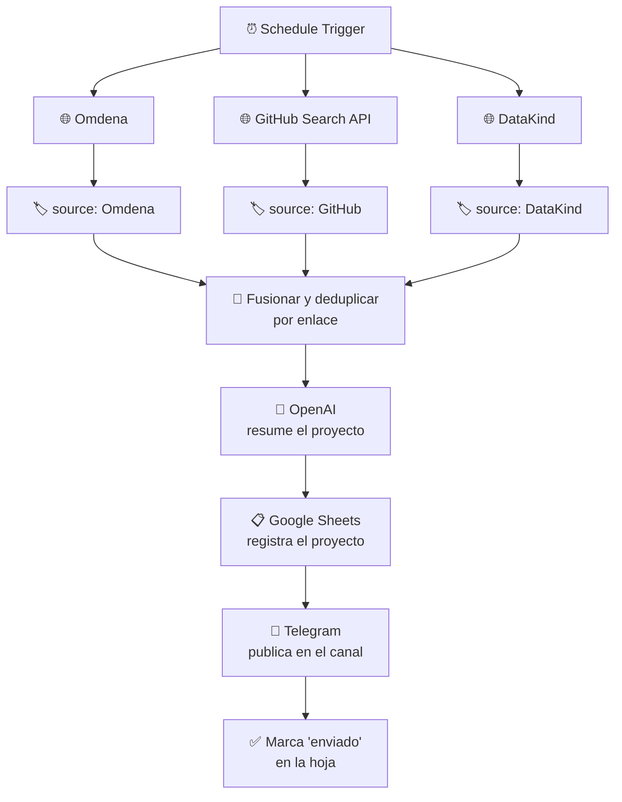

<h1 align="center">VolunteerAI Bot</h1>

  <b>Agrega proyectos de voluntariado en IA de tres fuentes y los publica en Telegram</b> 
  <i>Usar lo que sabes de datos e IA para algo que le importe a alguien.</i>

  
  
  

---

## El problema

Hay gente con conocimientos de datos e IA que quiere aportarlos a proyectos sociales, y hay organizaciones buscando exactamente ese perfil. No se encuentran porque las convocatorias están repartidas entre webs que hay que revisar una por una.

## La solución

Un bot que hace la ronda por las tres fuentes principales y publica lo nuevo en un canal abierto:

1. Un **schedule** dispara el flujo y consulta **en paralelo** tres fuentes: [Omdena](https://omdena.com/projects/), la **API de búsqueda de GitHub** (repos con "volunteer AI" en la descripción) y [DataKind](https://www.datakind.org/volunteer/).
2. Cada rama **etiqueta su origen** para que el mensaje final diga de dónde sale el proyecto.
3. Una función **fusiona las tres listas y elimina duplicados por enlace**.
4. **OpenAI resume** cada proyecto.
5. Se **guarda en Google Sheets** y se **publica en el canal de Telegram**, marcando en la hoja que ya se envió — así no se repite en la siguiente ronda.

## Cómo funciona

El detalle que sostiene todo el flujo es el **`Set` de deduplicación**: sin él, cada ejecución volvería a publicar los mismos proyectos y el canal sería inservible en dos días. La hoja de cálculo no está ahí para guardar datos, sino para dar **memoria** a un workflow que por naturaleza no la tiene.

## Stack

| Capa | Herramienta |
|---|---|
| Orquestación | n8n (schedule, ramas paralelas, función JS) |
| Fuentes | Omdena · GitHub Search API · DataKind |
| IA | OpenAI (resumen de cada proyecto) |
| Estado y registro | Google Sheets |
| Distribución | Telegram Bot API |

## Reproducirlo

1. Importa `volunteer_ai_bot.json` en n8n.
2. Sustituye `YOUR_GOOGLE_SHEET_ID` por el ID de tu hoja, con las columnas `Nome do Projeto`, `Data`, `Link` y `Enviado ao Telegram`.
3. Crea el bot con [@BotFather](https://t.me/BotFather), hazlo administrador de tu canal y cambia el `chatId`.
4. Reconecta las credenciales de OpenAI, Google Sheets y Telegram.

> El export está **sanitizado**: sin tokens ni IDs de hojas reales.

## Limitaciones conocidas

- **El parseo de Omdena y DataKind depende del HTML** de esas webs; si lo cambian, la rama se rompe en silencio. La de GitHub, al ir por API, es la única estable.
- **La deduplicación es por enlace**, así que un mismo proyecto publicado en dos fuentes con URLs distintas aparecería dos veces.
- **Sin filtro temático**: publica todo lo que encuentra, sin distinguir entre un proyecto de visión por computador y uno de fundraising.

## Autora

**Thaís Brandão** — Data Analyst & AI Strategist
[LinkedIn](https://www.linkedin.com/in/thaisbrand%C3%A3o/) · [GitHub](https://github.com/thaisbrandao)
