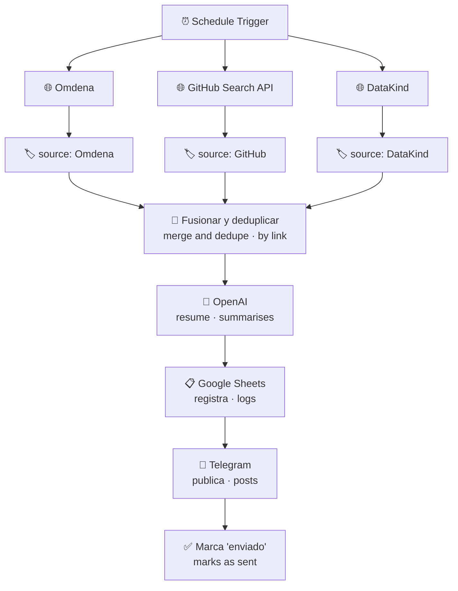

<h1 align="center">VolunteerAI Bot</h1>

  <b>Agrega proyectos de voluntariado en IA de tres fuentes y los publica en Telegram.</b> 
  <i>It aggregates AI volunteering projects from three sources and posts them to Telegram.</i>

  
  
  

> 🇪🇸 **Español** primero, 🇬🇧 **English** debajo en gris. La versión de referencia es la española. 
> <i>Spanish first, English underneath in grey. The Spanish version is the reference one.</i>

---

## 🎯 El problema · The problem

Hay gente con conocimientos de datos e IA que quiere aportarlos a proyectos sociales, y hay organizaciones buscando exactamente ese perfil. No se encuentran porque las convocatorias están repartidas entre webs que hay que revisar una por una.

<i>There are people with data and AI skills who want to give them to social projects, and organisations looking for exactly that profile. They don't find each other because the calls are scattered across sites you have to check one by one.</i>

## 💡 La solución · The solution

1. Un **schedule** consulta **en paralelo** tres fuentes: [Omdena](https://omdena.com/projects/), la **API de búsqueda de GitHub** y [DataKind](https://www.datakind.org/volunteer/). · <i>A schedule queries three sources in parallel: Omdena, the GitHub search API and DataKind.</i>
2. Cada rama **etiqueta su origen**. · <i>Each branch tags its source.</i>
3. Una función **fusiona las listas y elimina duplicados por enlace**. · <i>A function merges the lists and removes duplicates by link.</i>
4. **OpenAI resume** cada proyecto. · <i>OpenAI summarises each project.</i>
5. Se **guarda en Google Sheets** y se **publica en Telegram**, marcando en la hoja que ya se envió. · <i>It's saved to Google Sheets and posted to Telegram, marking in the sheet that it was sent.</i>

## ⚙️ Cómo funciona · How it works

El detalle que sostiene todo el flujo es la **deduplicación**: sin ella, cada ejecución volvería a publicar los mismos proyectos y el canal sería inservible en dos días. La hoja de cálculo no está ahí para guardar datos, sino para dar **memoria** a un workflow que por naturaleza no la tiene.

<i>The detail holding the whole flow together is deduplication: without it, every run would republish the same projects and the channel would be useless within two days. The spreadsheet isn't there to store data — it's there to give memory to a workflow that has none by nature.</i>

## 🧰 Stack

| Capa · Layer | Herramienta · Tool |
|---|---|
| Orquestación · Orchestration | n8n (schedule, ramas paralelas · parallel branches, función JS) |
| Fuentes · Sources | Omdena · GitHub Search API · DataKind |
| IA · AI | OpenAI |
| Estado · State | Google Sheets |
| Distribución · Delivery | Telegram Bot API |

## 🚀 Reproducirlo · Run it yourself

1. Importa `volunteer_ai_bot.json` en n8n. · <i>Import `volunteer_ai_bot.json` into n8n.</i>
2. Sustituye `YOUR_GOOGLE_SHEET_ID` y crea las columnas `Nome do Projeto`, `Data`, `Link` y `Enviado ao Telegram`. · <i>Replace `YOUR_GOOGLE_SHEET_ID` and create those four columns.</i>
3. Crea el bot con [@BotFather](https://t.me/BotFather), hazlo administrador del canal y cambia el `chatId`. · <i>Create the bot with @BotFather, make it a channel admin and change the `chatId`.</i>
4. Reconecta las credenciales de OpenAI, Google Sheets y Telegram. · <i>Reconnect the OpenAI, Google Sheets and Telegram credentials.</i>

> El export está **sanitizado**: sin tokens ni IDs de hojas reales. 
> <i>The export is sanitised: no tokens, no real sheet IDs.</i>

## ⚠️ Limitaciones conocidas · Known limitations

- **El parseo de Omdena y DataKind depende del HTML** de esas webs; si lo cambian, la rama se rompe en silencio. La de GitHub, al ir por API, es la única estable. <i>Parsing Omdena and DataKind depends on their HTML; if it changes, the branch breaks silently. The GitHub one, going through an API, is the only stable one.</i>
- **La deduplicación es por enlace**, así que un mismo proyecto con dos URLs aparecería dos veces. <i>Deduplication is by link, so the same project under two URLs would show up twice.</i>
- **Sin filtro temático**: publica todo lo que encuentra, sin distinguir entre visión por computador y fundraising. <i>No topic filter: it posts everything it finds, without telling computer vision from fundraising.</i>

## 👩🏽‍💻 Autora · Author

**Thaís Brandão** — Data Analyst &amp; AI Strategist
[LinkedIn](https://www.linkedin.com/in/thaisbrand%C3%A3o/) · [GitHub](https://github.com/thaisbrandao)
